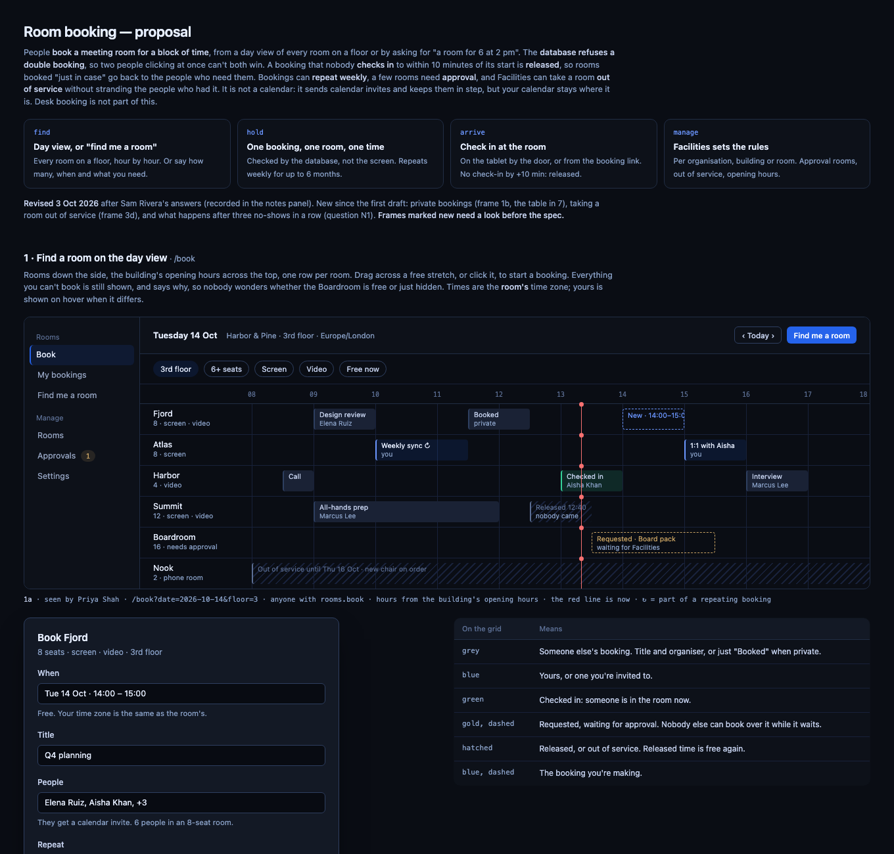
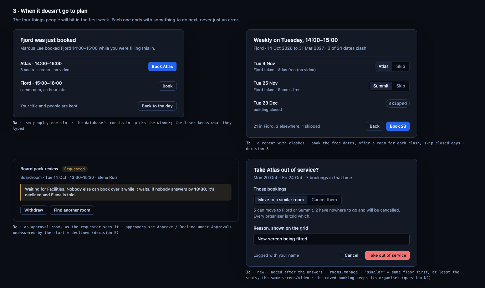
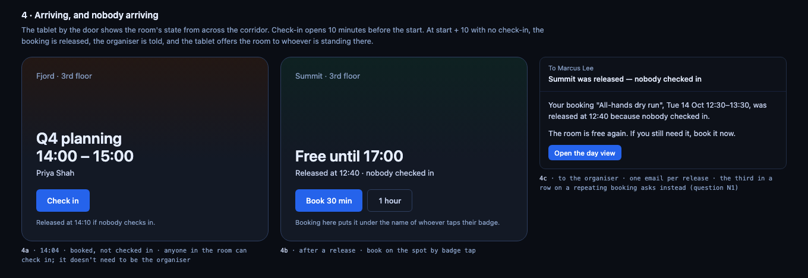
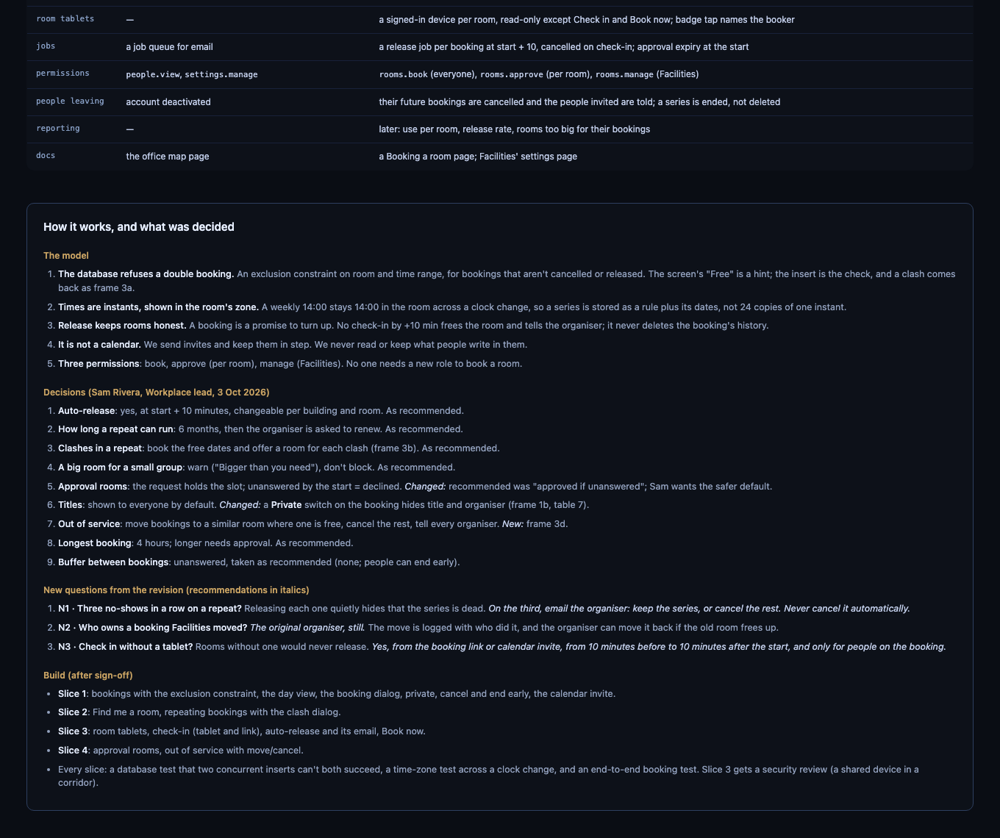
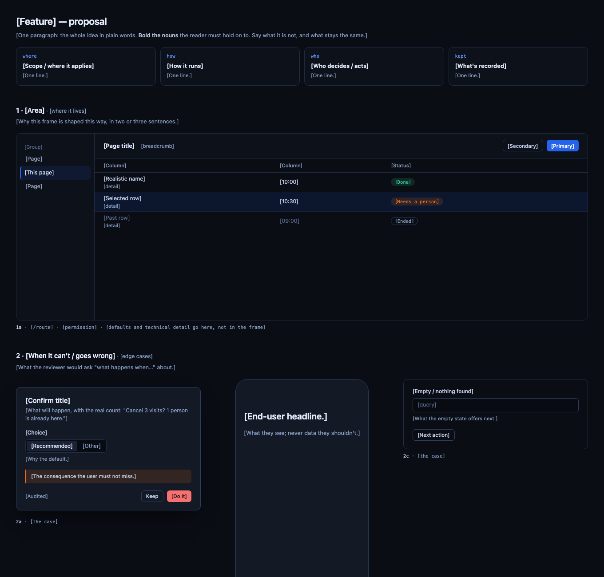

# decision-proposal

A [Claude Code](https://claude.com/claude-code) skill for deciding a feature before you build it.

Claude lays the feature out as **one visual HTML page**: the model in a paragraph, every screen and state as a mockup, the edge cases each drawn as their own frame, the exact wording for each state, a survey of what it touches in your real code, and **numbered questions, each with a recommended answer**. You answer in one message ("1 yes, 2 no, rest as recommended"). Claude folds the answers back into the page as a **decision register**, draws anything the answers added, asks the follow-up questions, and then writes a **one-page spec** that cites the decisions by number.

**propose → decide → spec**



## What's in the repo

| | |
|---|---|
| [`skills/decision-proposal/SKILL.md`](skills/decision-proposal/SKILL.md) | The method: what goes on the page, in what order, and how answers become decisions and then a spec. |
| [`template.html`](skills/decision-proposal/template.html) | **The blank page.** Every block with placeholders, in the visual style. Claude copies this. |
| [`spec-template.md`](skills/decision-proposal/spec-template.md) | The blank spec. |
| [`examples/room-booking.html`](skills/decision-proposal/examples/room-booking.html) | **A filled sample**: booking meeting rooms at a fictional company. It's shown after the decider answered, so you can see the decision register, a frame added after the answers, and follow-up questions. |
| [`examples/room-booking-spec.md`](skills/decision-proposal/examples/room-booking-spec.md) | The spec that sample became. |

See them as pages: **[the sample](https://doncampbell-hash.github.io/decision-proposal/skills/decision-proposal/examples/room-booking.html)** · **[the blank page](https://doncampbell-hash.github.io/decision-proposal/skills/decision-proposal/template.html)**. (GitHub's file view shows the HTML as code.)

## The sample: booking meeting rooms

A fictional company, Harbor & Pine, wants people to book meeting rooms for a block of time. The sample is the proposal for that after its first round of answers. It's here to show the method end to end, and as a starting point if you're designing a similar system: reserving something rather than someone (a room, a space, a piece of equipment).

**The idea and the main screen.** One paragraph says what it is and isn't. Four cards give the model. Then the day view: every room on a floor, hour by hour, with each kind of booking drawn, and a legend saying what each one means. That's the screenshot at the top of this page.

**Edge cases, each drawn.** Someone else booked the room while you were filling in the form. A weekly booking where 3 of 24 dates clash. A room that needs approval. Facilities taking a room out of service when 7 bookings are already in it. Each frame ends with something to do next. The caption under each one carries the technical detail and the decision it came from.



**The physical side.** The tablet by the door, before check-in and after a no-show releases the room, and the email the organiser gets.



**After the tables, the decision register.** These come first: which rule wins, states and wording, who sees what, and what it touches in the code. Then the panel at the bottom: the model; the decisions, with "Changed" where the answer differed from the recommendation; follow-up questions N1–N3; and the build slices.



The [spec it became](skills/decision-proposal/examples/room-booking-spec.md) cites those decisions by number.

## The blank page

What Claude starts from: every block, with placeholders saying what goes there.



## Install

**As a Claude Code plugin** (updates when the repo does):

```bash
claude plugin marketplace add doncampbell-hash/decision-proposal
```

```bash
claude plugin install decision-proposal@decision-proposal
```

**Or as a plain skill**: copy `skills/decision-proposal/` into `~/.claude/skills/` (every project on your machine), or into a repo's `.claude/skills/` (everyone working in that repo).

**Without Claude Code** (Claude chat, or another assistant): paste the body of `SKILL.md` as your prompt and attach `template.html`, plus the sample if you can.

## Use

Ask in plain words, in the project you're working on:

> Write a proposal for room booking, with the edge cases and the questions you need answered.

That's enough to start. [Example prompts](#example-prompts), below, show how to ask for something more specific.

Or invoke it by name: `/decision-proposal` (plain skill), or `/decision-proposal:decision-proposal` (plugin).

Then:
1. **Read the page** and answer the questions by number. Anything you skip is taken as recommended, and the page says so.
2. Claude **revises the page**: the questions become decisions, frames the answers added are marked "new", and follow-up questions appear as N1, N2… Repeat until nothing's open.
3. Ask for **the spec**. Build from it. As each piece ships, Claude adds an "As built" note to its section, so the spec stays true.

## Example prompts

All on the same topic, room booking, so you can compare what changes. The more you tell it, the less it has to guess. The useful things to say: what exists already, what's already decided, where the risk is, who will decide, and what's out of scope.

**1 · The simple ask.** Fine when the feature is new and you want Claude to find the questions.

```text
Write a proposal for room booking, with the edge cases and the questions you need answered.
```

**2 · Grounded in code that exists.** Point it at the files so the "what this touches" table is real and the mockups look like your app.

```text
Write a proposal for room booking. We already have a rooms table (used by the office
map), organisation → building settings with overrides, a job queue, and calendar sync
that reads free/busy. Read src/db/schema/rooms.ts, src/settings/ and src/calendar/
before you draw anything, and make the "what this touches" table name the real tables,
routes and permissions. Match the sidebar shell in app/(app)/layout.tsx and use the
colours in src/styles/tokens.css.
```

**3 · Some things already decided.** So it doesn't spend questions on settled ground.

```text
Write a proposal for room booking. Facilities has already decided these, so don't ask:
bookings are released 10 minutes after the start if nobody checks in; no buffer between
bookings; the longest booking is 4 hours. Spend the questions on what's still open:
repeating bookings, rooms that need approval, and what people outside a booking can
see of it. Put the riskiest question first.
```

**4 · Extending a feature you already have.** Narrow the scope, and name the edge cases you're worried about.

```text
We already have one-off room booking (see docs/specs/room-booking.md). Write a proposal
for weekly repeats. Draw every way a series goes wrong: dates that clash when it's
created, a room taken out of service halfway through, the organiser leaving the
company, a clock change, three no-shows in a row. Keep everything that exists as it
is unless a frame says why it has to change.
```

**5 · Where the risk is.** Tell it what to be careful about and it'll organise the page around that.

```text
Write a proposal for room tablets: a tablet by each meeting-room door showing the
room's day, with Check in and Book now. These are shared devices in public corridors,
so treat that as the main risk: what a tablet's sign-in can and can't do, what it
shows to someone walking past (private bookings), what happens if one is stolen, and
who can pair or remove one. Include a "what we keep, and what we never keep" table,
and mark which build slice needs a security review.
```

**6 · No screens.** The method works for an API or a back end: frames become request/response examples and the states table becomes the errors.

```text
Write a proposal for the room booking API only, no screens: create, move, cancel,
check in, and find a room. Use the frames for request and response examples, and the
states table for every status code and error. Draw these edge cases: two clients
booking the same slot at once, a retry with the same idempotency key, and a booking
moved while a client holds an old copy. Questions about versioning and rate limits
go first.
```

**7 · Written for the person deciding.** Say who answers and how they read.

```text
Write a proposal for room booking for Sam, our Workplace lead, to decide. Sam isn't
technical: keep routes, tables and permissions in the captions and the "what this
touches" table, and write the paragraphs and questions in plain words. No more than
eight questions.
```

**8 · Answering the questions.** You don't need to repeat the questions. Numbers are enough, and anything skipped is taken as recommended. These are the answers recorded in the sample's decision register:

```text
1–4 as recommended. 5: no, an approval request nobody answers by the start is
declined, not approved. 6: show titles by default, but add a Private switch that hides
the title and organiser. 7: move bookings to a similar room where one is free, cancel
the rest, tell every organiser, and draw it. 8 as recommended. Skipping 9.
```

**9 · Asking for the spec.** Once nothing's open.

```text
N1–N3 as recommended. Write the spec in docs/specs/room-booking.md: one section per
PR, the four slices from the build list. The tablet slice needs a security review.
Then mark the proposal approved.
```

## What makes it work

- **It reads your code first.** The "what this touches" table names real tables, routes and permissions, which is where hidden work turns up.
- **Edge cases are drawn, not footnoted.** Two people booking at once, a repeat that clashes, nobody turning up: each gets its own mockup, ending in something the user can do next.
- **Every question comes with a recommendation.** You decide by agreeing or saying no, not by writing an essay.
- **Decisions keep their numbers.** The spec says "decision 6", and anyone can find out why.
- **Mockups look like your product.** If the project has design tokens, Claude puts them in the page so the frames match your app.

## Licence

[MIT](LICENSE)
